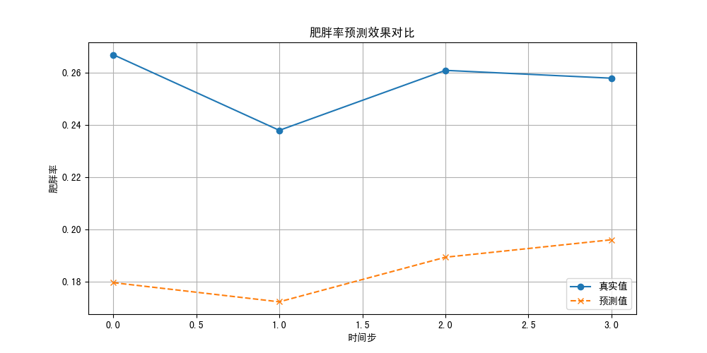

# 基层肥胖率预测项目

## 项目简介
基于时间卷积网络（TCN）的轻量化肥胖率预测模型，适用于数据稀缺的基层政府场景。

## 快速开始
### 安装依赖
```bash
pip install -r requirements.txt
```

### 数据准备
1. 全国数据：`data/national/national.csv`（格式：年份,肥胖率,人均GDP）
2. 基层数据：`data/local/local.csv`（格式：月份,肥胖率）  
（若无数据，运行`python generate_dummy_data.py`生成示例数据）

### 运行预测
```bash
python main.py
```

### 结果查看
- 预测结果：`results/predictions/pred.csv`
- 可视化图表：`results/figures/result.png`

## 项目结构
```text
obesity_prediction_project/
├── data/          # 数据目录
├── models/        # 模型代码
├── utils/         # 工具函数
├── configs/       # 配置文件
└── results/       # 输出结果
```

## 示例结果
